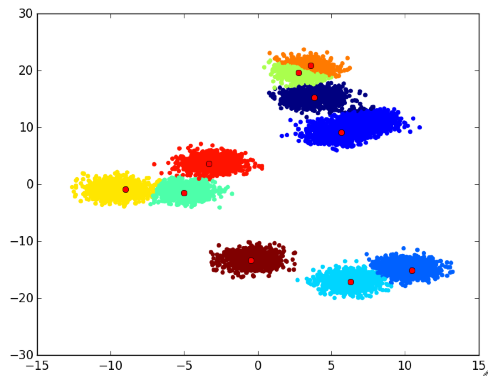

# KShiftsClustering

[](https://travis-ci.org/rened/KShiftsClustering.jl)

A very fast method for data clustering, yielding results similar to kmeans in a fraction of the time. It updates its cluster centers using one data point at a time, so it is well suited for streaming clustering.

Pseudo code:

```
Randomly sample k centers from data
for sample in data
    shift the clostest center into the direction of sample
```

#### Usage

```jl
data = rand(2,1000)
centers = kshifts(data,10)
labels = kshiftlabels(data, centers)
```

To perform online clustering, you can update the cluster centers with more data:
``jl
data = rand(2,1000)
centers = kshifts(data,10)
for i = 1:100
    data = rand(2,10)
    kshifts!(data, centers)
end
```

#### Performance

KShifts is very fast, and has very low memory requirements:
```jl
data = rand(2,100_000)

@time begin
    centers = kshifts(data,10)
    labels = kshiftlabels(data, centers)
end
#  =>  elapsed time: 0.026258854 seconds (401400 bytes allocated)

# using kmeans from Clustering.jl:
@time kmeans(data,10)
#  =>  elapsed time: 2.329909439 seconds (1723782768 bytes allocated, 53.93% gc time) 
```

#### Results

Finally, let's plot the results:

```jl
using PyPlot
scatter(data[1,:], data[2,:], c=labels, marker = "o")
plot(centers[1,:], centers[2,:], "ro")
```

